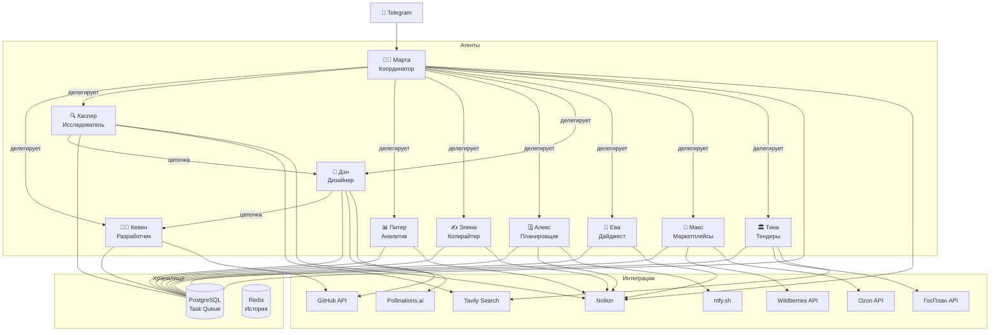

# 🏢 AI Office

Команда из 10 AI-агентов на базе **Claude API**, управляемых через Telegram. Автоматизирует маркетплейс-бизнес (WB + Ozon): отвечает на отзывы, строит аналитику, пишет тексты, создаёт сайты, мониторит тендеры. Один Python процесс на Railway.

→ Полная документация, roadmap и антипаттерны: **[ROADMAP.md](ROADMAP.md)**
→ Интерактивная схема архитектуры: **[docs/index.html](docs/index.html)**

---

## Архитектура



---

## Быстрый старт

```bash
git clone https://github.com/titboan/ai-office.git && cd ai-office
pip install -r requirements.txt
cp .env.example .env   # вставь токены
python main.py         # запускает все агенты
```

Деплой: Railway — один сервис, все переменные из `.env`, `railway up`.
